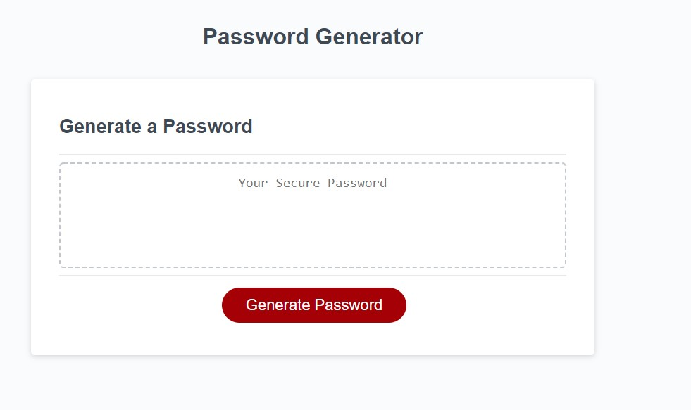

# password-generator

This simple website will generate a randomly generated password based off user-given criteria

## How-To

When the Generate Password button is pressed, the webpage will prompt the user to input the password length. After the password length is input, the site will then prompt the user to choose which character types should be included in the password. The final password generated will be a random combination of characters chosen based on the user's input

## How it works

Four variables are defined at the start of the script to indiciate which characters are usable by storing them in an array. The system will prompt the user to pick a length between 8 and 128 characters. If an invalid response is given, it alerts the user and restarts the function. Assuming valid responses are given, the script will then prompt the user for which character types to include in the password and storing them to a variable.

The system will make sure that the user at least gave one character type. If no character type was given, the function will restart and the user will have to pick the password length & character types again. Assuming all criterion are met, an empty array will be created to house the possible characters based on the user's choice.

A for loop iterates through the length of the password and picks a random character each time. These characters get stored to an empty variable until the iteration is complete. The system will display the results in the HTML.